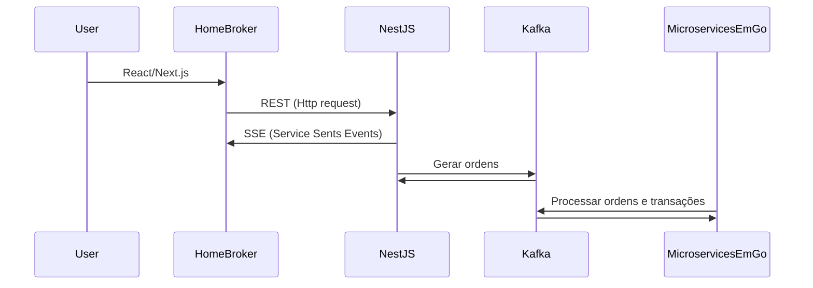

# Imersão Full Stack && Full Cycle 

## Tecnologias
- [x] Docker
- [x] Next.js
- [x] Nest.js
- [x] Apache Kafka
- [x] GoLang
- [x] SSE (Server Sent Events)

---
## Fluxo de comunicação

```mermaid
sequenceDiagram
    participant User
    participant HomeBroker
    participant NestJS
    participant Kafka
    participant MicroservicesEmGo
    User->>HomeBroker: React/Next.js
    HomeBroker->>NestJS: REST (Http request)
    NestJS->>HomeBroker: SSE (Service Sents Events)
    NestJS->>Kafka: Gerar ordens
    Kafka->>NestJS: 
    MicroservicesEmGo->>Kafka: Processar ordens e transações
    Kafka->>MicroservicesEmGo: 

```
