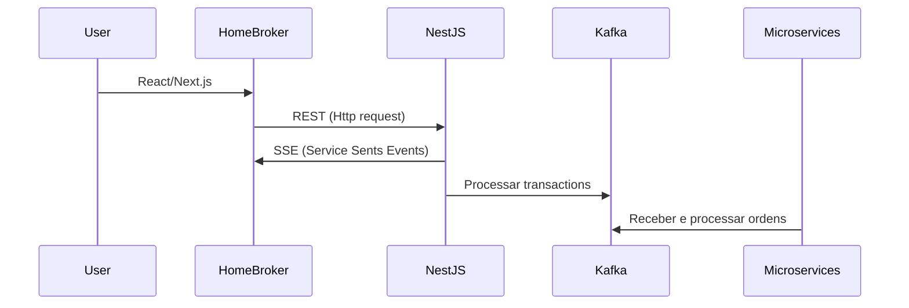

# Imersão Full Stack && Full Cycle 

## Tecnologias
### - Docker
### - Next.js
### - Nest.js
### - Apache Kafka
### - GoLang

---
## Fluxo de comunicação

```mermaid
sequenceDiagram
    participant User
    participant HomeBroker
    participant NestJS
    participant Kafka
    participant Microservices
    User->>HomeBroker: React/Next.js
    HomeBroker->>NestJS: REST (Http request)
    NestJS->>HomeBroker: SSE (Service Sents Events)
    NestJS->>Kafka: Processar transactions
    Microservices->>Kafka: Receber e processar ordens
```
